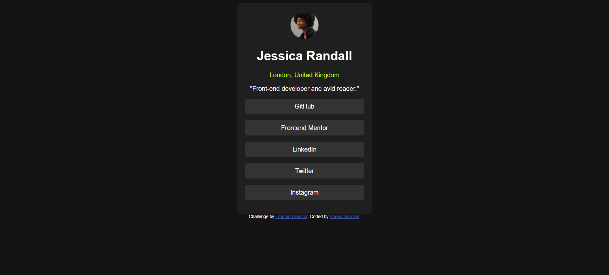

# Frontend Mentor - Social links profile solution

This is a solution to the [Social links profile challenge on Frontend Mentor](https://www.frontendmentor.io/challenges/social-links-profile-UG32l9m6dQ). Frontend Mentor challenges help you improve your coding skills by building realistic projects.

## Table of contents

- [Overview](#overview)
  - [The challenge](#the-challenge)
  - [Screenshot](#screenshot)
  - [Links](#links)
- [My process](#my-process)
  - [Built with](#built-with)
  - [What I learned](#what-i-learned)
  - [Continued development](#continued-development)
  - [Useful resources](#useful-resources)
- [Author](#author)

**Note: Delete this note and update the table of contents based on what sections you keep.**

## Overview

### The challenge

Users should be able to:

- See hover and focus states for all interactive elements on the page

### Screenshot



### Links

- Solution URL: [Add solution URL here](https://www.frontendmentor.io/solutions/responsive-social-links-profile-using-html-and-css-flex-LIQo1gsr_3)
- Live Site URL: [Add live site URL here](https://section33-ops.github.io/social-links-profile/)

## My process

### Built with

- Semantic HTML5 markup
- Flexbox
- Mobile-first workflow

### What I learned

I practiced using css flex.

```css
main {
  display: flex; /* Enables flexbox */
  justify-content: center; /* Centers items horizontally */
  align-items: center; /* Centers items vertically */
  flex-direction: column; /* Optional: Stack items vertically (like text below an image) */
  min-height: 200px;
}
```

### Continued development

- I would like to make the page more responsive
- I would like to match it with the design

## Author

- Website - [Saeed Mamani](https://section33-ops.github.io/my-portfolio/)
- Frontend Mentor - [@Section33-ops](https://www.frontendmentor.io/profile/Section33-ops)
